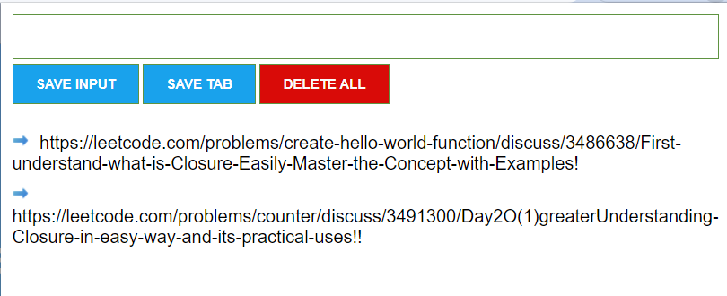

# TabSaver - A URL Vault

TabSaver is a extension that simplifies the process of saving and organizing web pages for easy access. With just a click, you can store your favorite URLs and access them whenever you need. Say goodbye to losing valuable content and hello to efficient bookmarking with TabSaver!

## Key Concepts Used

### `DOM Manipulation`
- **Document Object Model (DOM)** manipulation is a fundamental part of your extension, allowing you to interact with and modify web page content dynamically.

### `getElementById()`
- `getElementById()` is a method to access and manipulate specific elements on a web page by their unique ID attribute.

### `querySelector()`
- `querySelector()` is used to select and manipulate HTML elements using CSS-like selectors.

### `addEventListener()`
- `addEventListener()` is employed to register event listeners and handle user interactions, such as button clicks or other events.

### `innerText`
- `innerText` is used to set or retrieve the text content of an HTML element.

### `textContent`
- `textContent` may be used to manipulate the text content of an HTML element, including text nodes.

### `innerHTML`
- `innerHTML` allows you to get or set the HTML content within an element, which can be helpful for rendering and updating content.

### `Template Strings`
- Template strings (backticks) are used for creating dynamic strings with embedded variables and expressions, making it easier to generate content.

### `Local Storage`
- **Local Storage** is employed to store and manage saved URLs locally within the user's browser, ensuring they persist across sessions.

## Features

- **One-Click URL Saving:** Easily save the current tab's URL with a single click.
- **URL Vault:** Store your saved URLs in a secure vault.
- **Quick Access:** Retrieve your saved URLs with ease.
- **Delete URLs:** Remove URLs from your vault when you no longer need them.

## Installation

You can install TabSaver manually by following these steps:

1. Download the extension files from the [GitHub repository](https://github.com/0xyashanand/tab-saver).
2. Extract the downloaded files to a directory on your computer.
3. Open your browser.
4. Go to the `browser://extensions/` page by entering it in the address bar and pressing Enter.
5. Enable `Developer mode` in the top right corner of the `browser://extensions/` page.
6. Click the "Load unpacked" button, and then select the directory where you extracted the extension files.
7. Once selected, click `Open` to load the extension.
8. TabSaver is now installed, and you will see the TabSaver icon in your browser's toolbar.

## How to Use

1. Click the TabSaver icon in your browser's toolbar to Launch the extension.
2. Save the current tab by clicking save button.
3. Access your saved URLs by clicking the TabSaver icon.
4. Delete URLs from your vault when they are no longer needed by Double click on delete button.

## Preview

## Feedback and Issues

If you encounter have any suggestions, or would like to report a bug, please feel free to open an issue on our [GitHub Repository](https://github.com/0xyashanand/tab-saver).

## Contact

For any inquiries or assistance, please contact me at [0xyashanand@gmail.com](mailto:0xyashanand@gmail.com).

---

Enjoy using TabSaver, and happy bookmarking!

